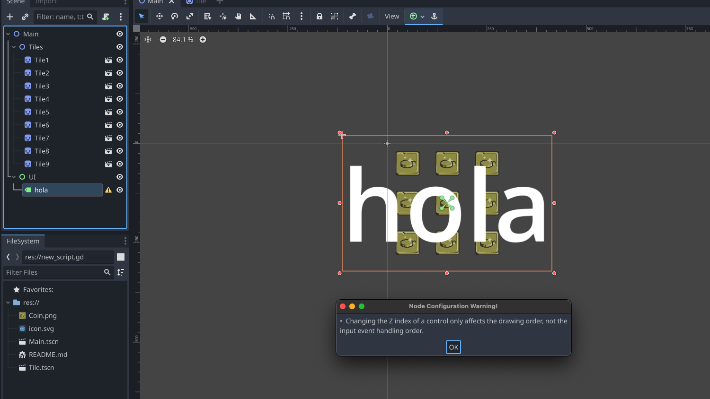

# WHY?

this is a test repository to investigate about something I'm not sure I'm doing properly in Godot

# WHAT?

An irritating warning arises when modifying the z_index property of a label in Godot. This adjustment is necessary to display the label in front of tiles. The need for a higher z_index for the label arises from the tiles' requirement for elevated z_index values. This is due to the tiles having multiple sprites: hover effect, background, bottom shadow... needing higher z_index values (this project is a simplified version so there is only one single sprite per tile)

# SO..

Is there a way of having the label on top without living with a warning all the rest of my life? (ok, maybe I was a bit melodramatic)